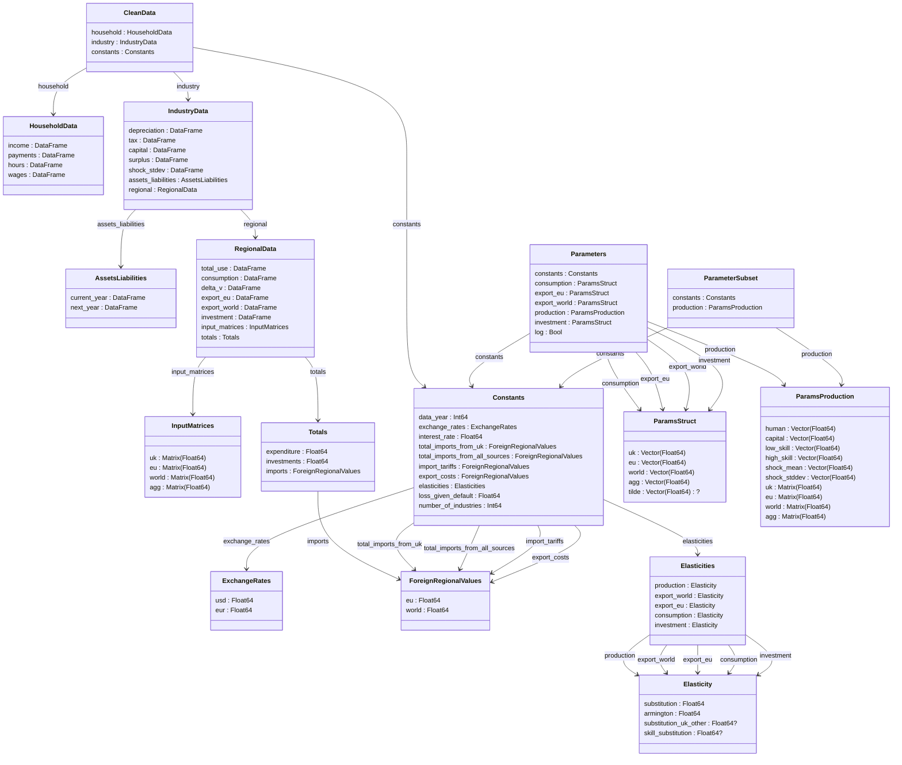

# Supergrassi

[](https://github.com/JuliaTesting/Aqua.jl)
[](https://github.com/UCL/Supergrassi.jl/actions/workflows/UnitTests.yml?query=branch%3Amain)
[](https://codecov.io/gh/UCL/Supergrassi.jl)

Multi-sector dynamic macroeconomics model with debt and default

## Read data into Julia

```julia
using Supergrassi

settings_path = create_filepath("config/settings.yml")
settings = read_settings(settings_path)
filepaths = check_file_availability(settings)
data = read_data(filepaths, settings)

```


